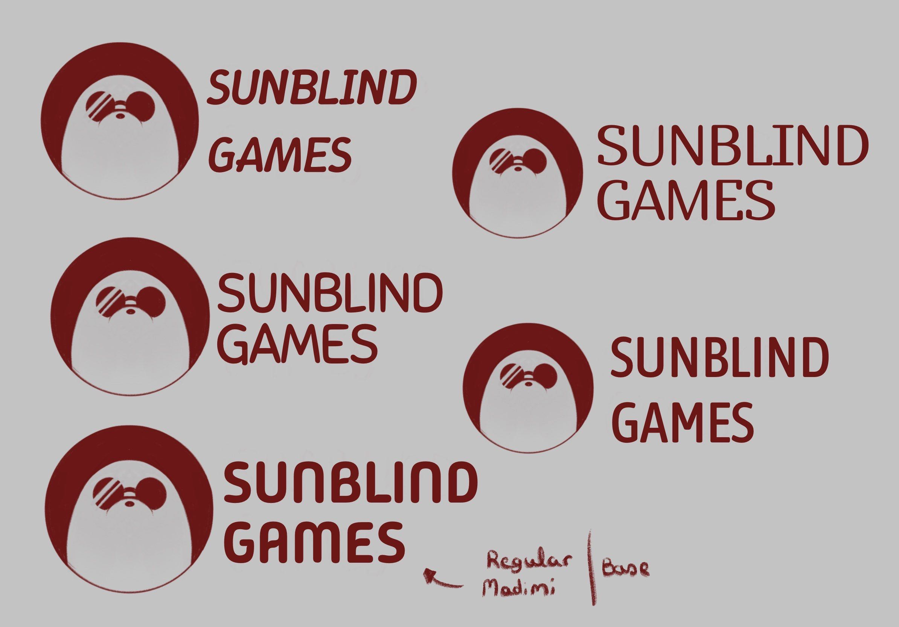
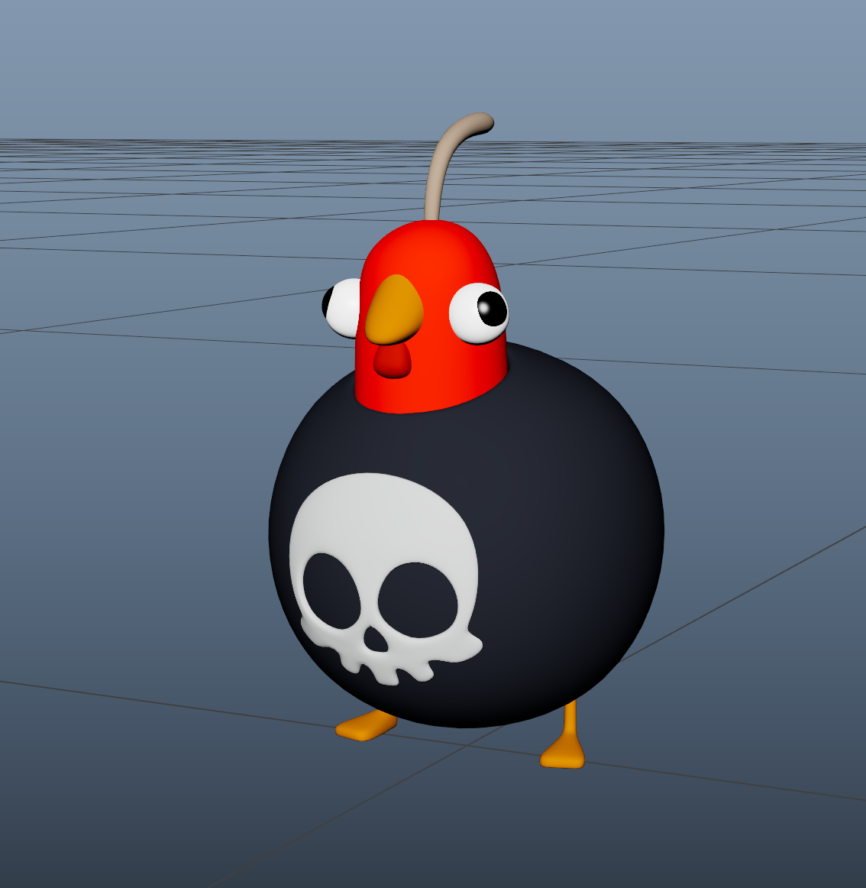
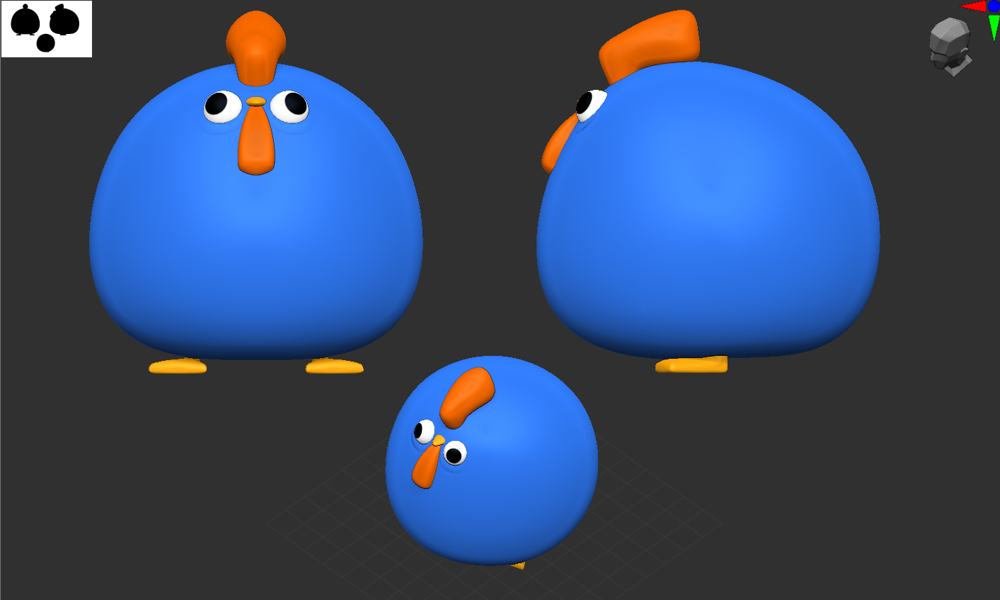
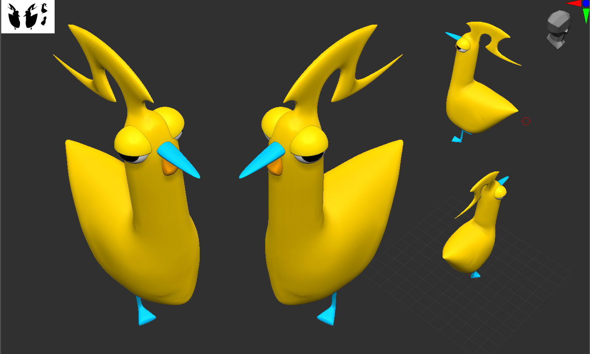
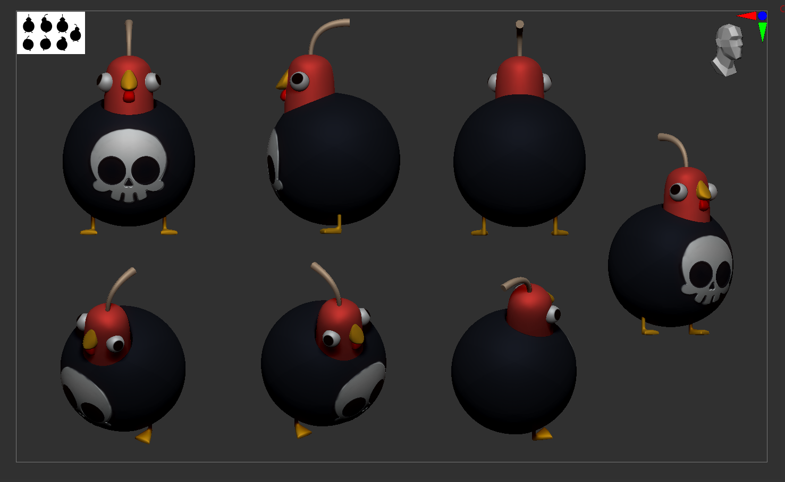
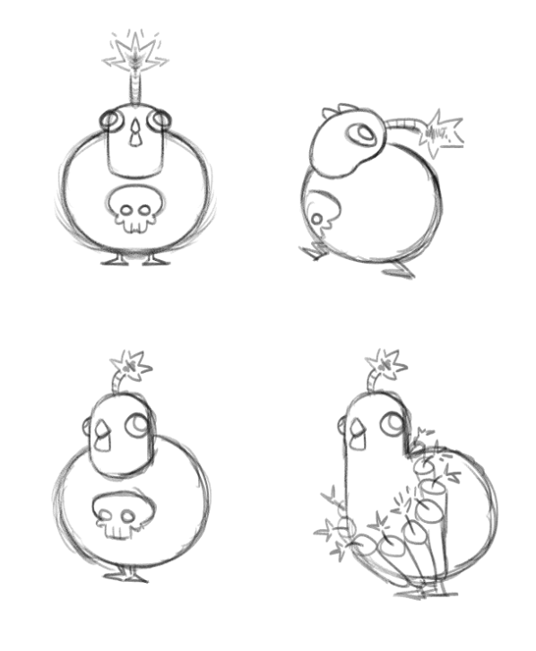

<!DOCTYPE html>
<html lang="en">
<head>
  <meta charset="UTF-8">
  <meta name="viewport" content="width=device-width, initial-scale=1.0">
  <title>FKC! Fighting Krazy Chickens! | Sunblind Games</title>
  <meta name="description" content="FKC! Fighting Krazy Chickens! — A comedic bullet-heaven action game where enemies are your ammunition. Grab, throw, and cause physics-based chaos. By Sunblind Games.">
  <meta property="og:title" content="FKC! Fighting Krazy Chickens!">
  <meta property="og:description" content="A comedic bullet-heaven where enemies are your ammunition. Grab. Throw. Chaos.">
  <meta property="og:image" content="poster feria.png">
  <meta property="og:type" content="website">
  <meta name="theme-color" content="#D96A30">

  <!-- Fonts -->
  <link rel="preconnect" href="https://fonts.googleapis.com">
  <link rel="preconnect" href="https://fonts.gstatic.com" crossorigin>
  <link href="https://fonts.googleapis.com/css2?family=Luckiest+Guy&family=Outfit:wght@300;400;700&display=swap" rel="stylesheet">

  <!-- Styles -->
  <link rel="stylesheet" href="style.css">
</head>
<body>

  <!-- TOP BAR -->
  <nav class="top-bar" id="topBar">
    
    Sunblind Games
  </nav>

  <!-- HERO -->
  <section class="hero" id="hero">
    

    

    

    

    <h1 class="hero-title">
      FKC!
      Fighting Krazy Chickens!
    </h1>

    

    

      Scroll
      <svg xmlns="http://www.w3.org/2000/svg" viewBox="0 0 24 24" fill="none" stroke-width="2" stroke-linecap="round" stroke-linejoin="round">
        <path d="M12 5v14M19 12l-7 7-7-7"/>
      </svg>
    

  </section>

  <!-- GAMEPLAY VIDEO -->
  <section class="gameplay" id="gameplay">
    

      

        &#9654; Gameplay Preview
      

      

        <video autoplay muted loop playsinline>
          <source src="gameplay.mp4" type="video/mp4">
          Your browser does not support video playback.
        </video>
      

    

  </section>

  <!-- ABOUT -->
  <section class="about" id="about">
    

      

        <h2>Enemies Are Your Ammunition</h2>
        

          <strong>FKC!</strong> is a <strong>comedic bullet-heaven action game</strong> that turns the genre on its head. 
          Forget auto-fire — here you <strong>grab enemies and hurl them</strong> back into the chaos.
        

      

      

        
      

    

  </section>

  <!-- GAME MODES -->
  <section class="modes" id="modes">
    

      <h2>Three Ways to Play</h2>
      
Whether you want a solo adventure, cooperative madness, or competitive chaos — FKC! has you covered.

    

    

      

        
⚔️

        <h3>Adventure</h3>
      

      

        
🤝

        <h3>Co-op</h3>
      

      

        
👑

        <h3>King of the Ring</h3>
      

    

  </section>

  <!-- GALLERY -->
  <section class="gallery" id="gallery">
    

      <h2>Meet the Chickens</h2>
    

    

      

        
      

      

        
      

      

        
      

      

        
      

      

        
      

    

  </section>

  <!-- CTA -->
  <section class="cta reveal">
    

      <h2>Hope you are excited!</h2>
      
FKC! is currently in development. Stay tuned for the playable demo and release date.

    

  </section>

  <!-- CONTACT -->
  <section class="contact" id="contact">
    <h2>Contact Us</h2>
    
We're an indie studio based in Madrid, Spain. Got questions, feedback, or press inquiries?

    <a href="mailto:contact@sunblindgames.com" class="contact-email">
      <svg xmlns="http://www.w3.org/2000/svg" viewBox="0 0 24 24" fill="none" stroke-width="2" stroke-linecap="round" stroke-linejoin="round">
        <rect x="2" y="4" width="20" height="16" rx="2"/>
        <path d="m22 7-8.97 5.7a1.94 1.94 0 0 1-2.06 0L2 7"/>
      </svg>
      contact@sunblindgames.com
    </a>
  </section>

  <!-- FOOTER -->
  <footer class="site-footer">
    
    
&copy; 2026 Sunblind Games · Madrid, Spain

    
Made with 🐔 and a lot of chaos

  </footer>

  <!-- SCRIPTS -->
  

</body>
</html>